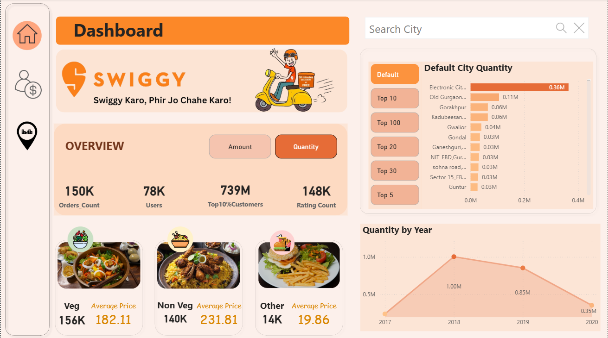

# 🍴 Swiggy Sales Analysis Dashboard  

## 📌 Project Objective  
The **Swiggy Sales Analysis Dashboard** is designed to provide an end-to-end analysis of Swiggy’s business performance using **Excel, Power Query, DAX, and Power BI**.  

The goal of this project is to deliver actionable insights into:  
- Order and Sales performance across multiple cities  
- Customer demographics and purchasing behavior  
- Food category analysis (Veg, Non-Veg, Others)  
- User engagement through ratings and repeat orders  
- Long-term growth trends of sales and customers  

This project bridges the gap between **raw sales data** and **business decision-making**, enabling stakeholders to make data-driven choices for expansion, marketing, and customer retention.  

---

## 📊 Dashboard Overview  

The solution consists of **3 interactive dashboards**, each focusing on a different aspect of the business.  

---

### 1️⃣ City Overview Dashboard  
  

**Key Features:**  
- 🌍 **Map Visualization** – Sales & Orders distribution across Indian cities  
- 📊 **City-wise Performance Table** – Total Sales, Orders, and Current Year Sales  
- 🏙️ **Top Cities Bar Chart** – Identify high-revenue cities  
- 👥 **User & Ratings Metrics** – Number of users and engagement levels  

**Business Value:**  
- Helps Swiggy identify **hotspot cities** with maximum contribution  
- Supports decision-making for **regional expansion strategies**  
- Provides a clear picture of **city-level sales dominance**  

---

### 2️⃣ User Performance Dashboard  
  

**Key Features:**  
- 👤 **KPIs** – User Count, Top 10% Customers, Year-on-Year Sales  
- 🧑‍🤝‍🧑 **Demographic Segmentation** –  
  - Gender split (Male/Female)  
  - Age group distribution  
  - Marital Status (Single vs Married)  
  - Occupation categories (Students, Employees, Self-Employed, Homemakers)  

**Business Value:**  
- Reveals **who the key customers are** (demographics & behavior)  
- Highlights **age groups and professions** most likely to order on Swiggy  
- Enables Swiggy to run **targeted marketing campaigns**  

---

### 3️⃣ Orders & Sales Dashboard  
  

**Key Features:**  
- 📦 **Overall KPIs** – Orders, Users, Top 10% Customers, Ratings Count  
- 🍲 **Food Category Insights** – Veg vs Non-Veg vs Others with price comparison  
- 📈 **Yearly Trend Analysis** – Orders and Sales from 2017 to 2020  
- 🏆 **Top City Comparisons** – Flexible view (Top 10, Top 20, Top 100 cities)  

**Business Value:**  
- Provides visibility into **food preferences** (Veg/Non-Veg)  
- Tracks **year-on-year growth trends** in orders & revenue  
- Identifies **top-performing cities** to optimize delivery and promotions  

---

## ⚙️ Technical Workflow  

### 🔹 Step 1 – Data Import  
- Collected raw data in **Excel format**  
- Imported into Power BI  

### 🔹 Step 2 – Data Cleaning & Transformation (Power Query)  
- Removed duplicates  
- Standardized city names & categories  
- Filled missing/null values  
- Converted datatypes  

### 🔹 Step 3 – Data Modeling  
- Designed a **star schema** with fact & dimension tables  
- Built relationships between multiple datasets (Food, Menu, Orders, Restaurant, Users)  

### 🔹 Step 4 – DAX Calculations  
Created calculated columns and measures for business KPIs, such as:  
- Total Sales  
- Current vs Previous Year Sales  
- Orders Count  
- Top 10% Customer Contribution  
- Average Food Price by Category  

### 🔹 Step 5 – Dashboard Development  
- Built 3 dashboards with **cards, bar charts, line charts, maps, and donut charts**  
- Applied **Swiggy theme (orange/black)** for consistency  
- Added **interactive slicers, drill-downs, and filters**  

---

## 🚨 Business Problems Solved  

- 📍 Which **cities contribute most** to Swiggy’s revenue?  
- 👥 What are the **key customer demographics** (age, gender, occupation)?  
- 🍲 Which **food categories dominate** (Veg vs Non-Veg)?  
- 📊 How have **orders & sales trended** across years?  
- ⭐ What is the impact of **ratings & repeat customers** on growth?  

---

## ✅ Key Insights  

- **Tirupati, Electronic City, Baner (Pune)** emerged as top-performing regions  
- **Users aged 22–24** form the largest customer base  
- **Employees and Students** dominate the customer segments  
- **Veg food items** lead in quantity, while **Non-Veg has higher average order value**  
- **Top 10% customers contribute a significant share** of sales  

---

## 🛠️ Tech Stack  

- **Excel** → Raw Dataset  
- **Power Query** → Data Cleaning & Transformation  
- **DAX** → Business KPIs & Measures  
- **Power BI** → Interactive Dashboard Development  

---

## 📂 Project Structure  

```
📦 Swiggy-Sales-Analysis-Dashboard
┣ 📊 City Overview.png
┣ 📊 User Performance.png
┣ 📊 Dashboard.png
┣ 📄 README.md
┗ 📁 Dataset (Not uploaded – use your own dataset)
```
---

## 📌 Notes  

⚠️ **Dataset not included in this repo.**  
Due to licensing and privacy concerns, the raw Excel/CSV dataset used in this project is not shared here.  
However, you can replicate the project by:  
- Downloading any Swiggy/Zomato dataset from **Kaggle**  
- Cleaning & transforming data using **Power Query**  
- Rebuilding visuals in **Power BI** with your own dataset  

---

## 👨‍💻 Author  

**Kamal Nayan Tiwary**  
**Data Analyst**

📧 **kamalnayantiwary73@gmail.com**  
🔗 [LinkedIn](https://www.linkedin.com/in/kamal-nayan-tiwary-2022-2026-/)  

---

